# skynapi Architecture

A production-grade Go REST API providing city search and weather forecasting services with intelligent caching and fuzzy text search capabilities.

## Table of Contents

1. [Overview](#overview)
2. [System Architecture](#system-architecture)
3. [Layered Architecture](#layered-architecture)
4. [Component Interactions](#component-interactions)
5. [Request Flows](#request-flows)
6. [Data Models](#data-models)
7. [Deployment Architecture](#deployment-architecture)
8. [Technology Stack](#technology-stack)

---

## Overview

**skynapi** is a two-service REST API built with Go 1.21+, providing:

- **City Search**: Fuzzy text search across 150k+ cities using PostgreSQL trigram similarity
- **Weather API**: Intelligent caching layer over met.no, with conditional GET and stale-cache fallback

**Key characteristics:**
- Clean hexagonal (layered) architecture with dependency injection
- Interface-driven design for testability
- Structured JSON logging with `slog`
- Type-safe PostgreSQL with `pgxpool`
- Graceful degradation and resilience patterns
- YAML configuration with environment overrides

---

## System Architecture

### High-Level System Diagram

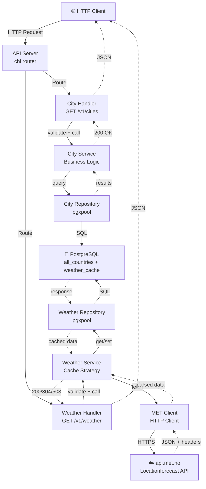

---

## Layered Architecture

The application follows a **clean hexagonal (onion) architecture** with four distinct layers:

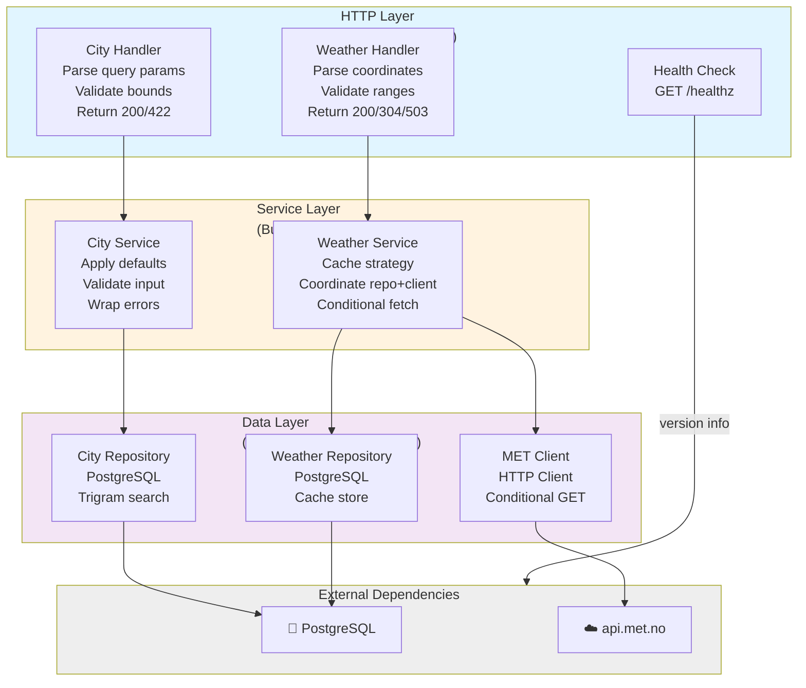

### Layer Responsibilities

| Layer | Responsibility | Key Classes |
|-------|-----------------|------------|
| **HTTP** | Parse/validate requests, serialize responses | `CityHandler`, `WeatherHandler` |
| **Service** | Business logic, validation, orchestration | `CityService`, `WeatherService` |
| **Data** | Persistence, external API calls | `*Repository`, `*Client` |
| **External** | Third-party systems | PostgreSQL, api.met.no |

---

## Component Interactions

### Dependency Injection & Interface Pattern

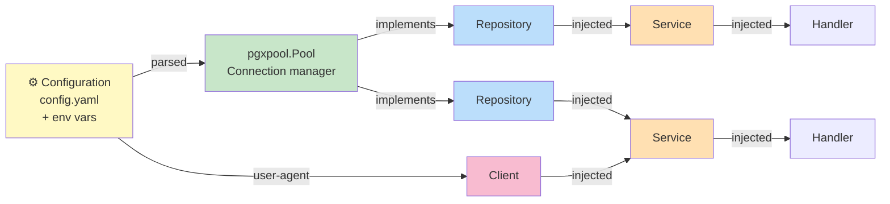

**Key Principle:** Every component is initialized through constructors that accept interfaces, enabling:
- Easy mocking in unit tests
- Loose coupling between layers
- Testability without real databases

---

## Request Flows

### City Search Request Flow

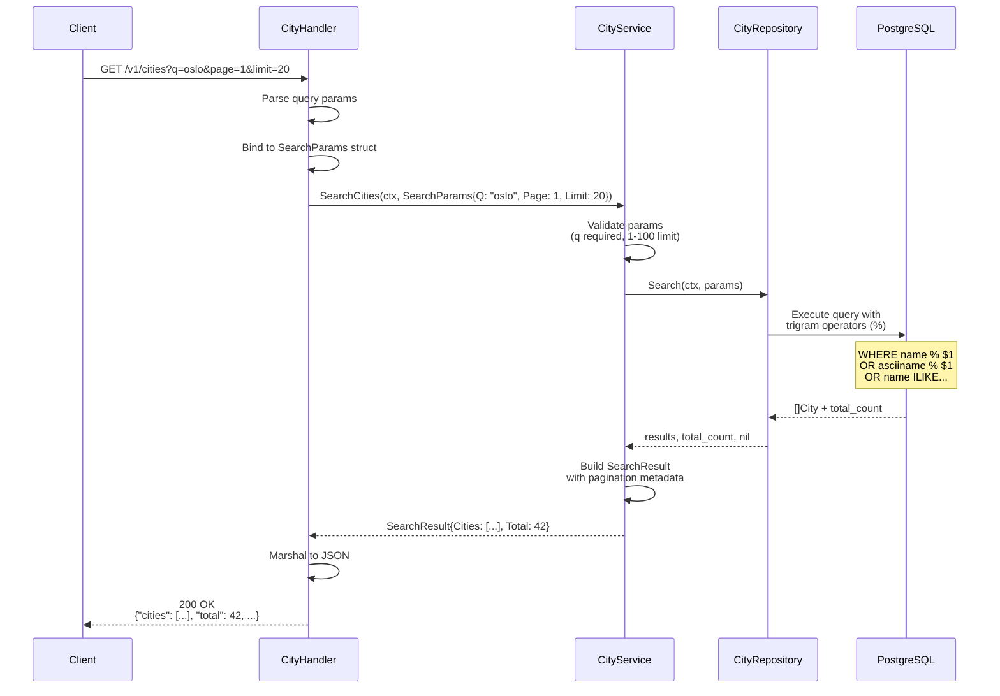

### Weather Fetch Request Flow (Cache Strategy)

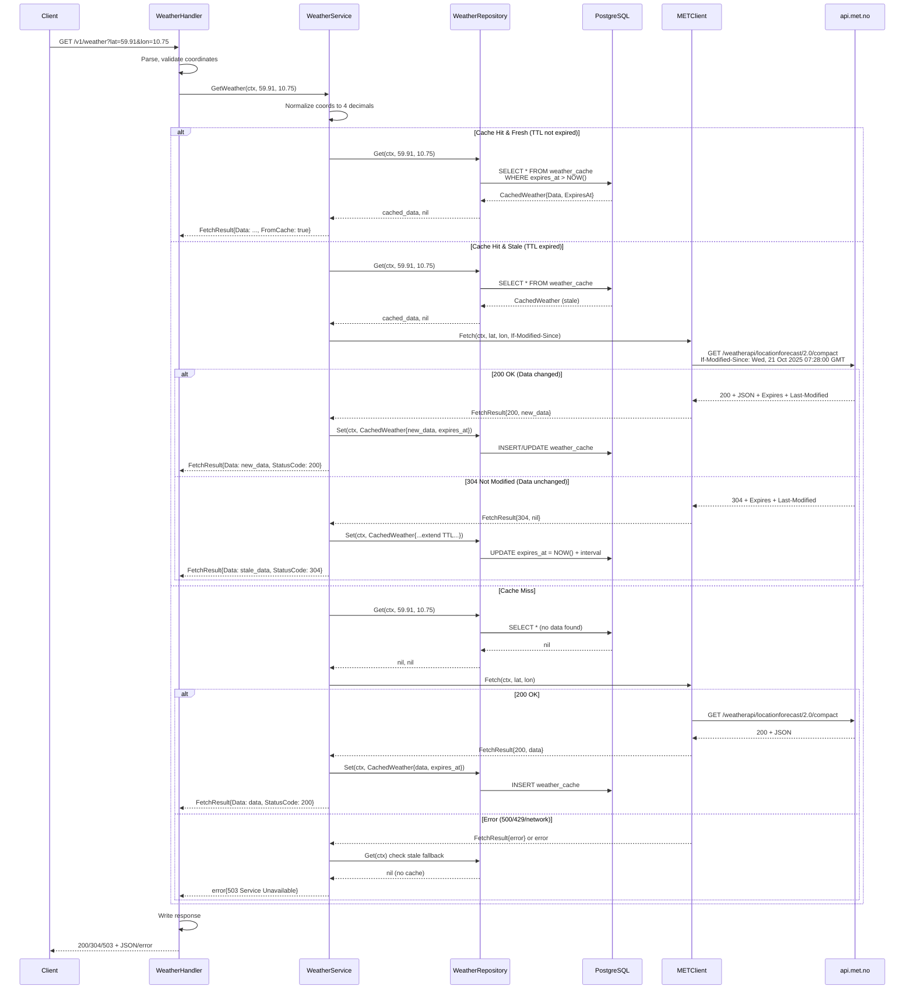

---

## Data Models

### Entity Relationship Diagram

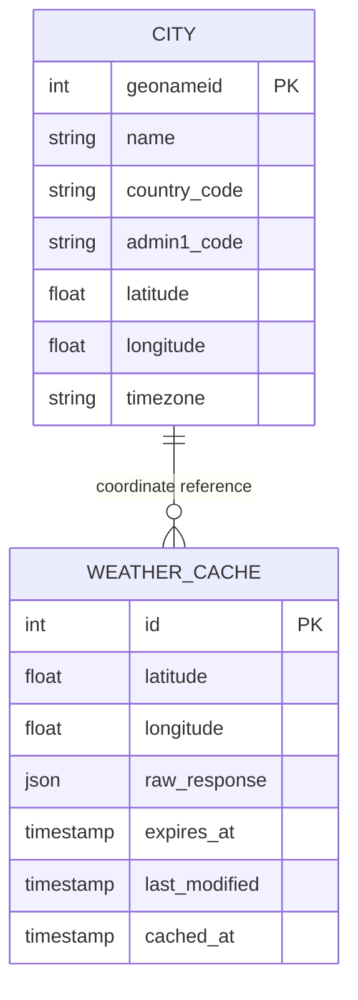

### City Model

```go
type City struct {
    GeonameID   int     `json:"geonameId"`
    Name        string  `json:"name"`
    CountryCode string  `json:"countryCode"`
    Region      string  `json:"region"`
    Lat         float64 `json:"lat"`
    Lon         float64 `json:"lon"`
    Timezone    string  `json:"timezone"`
}

type SearchParams struct {
    Q     string `validate:"required,min=1"`
    Page  int    `validate:"min=1"`
    Limit int    `validate:"min=1,max=100"`
}
```

### Weather Model

```go
type CachedWeather struct {
    Latitude      float64
    Longitude     float64
    RawResponse   json.RawMessage  // Stored JSON from api.met.no
    ExpiresAt     time.Time
    LastModified  time.Time
}

type WeatherRequest struct {
    Lat float64 `validate:"min=-90,max=90"`
    Lon float64 `validate:"min=-180,max=180"`
}
```

---

## Deployment Architecture

### Container & Infrastructure

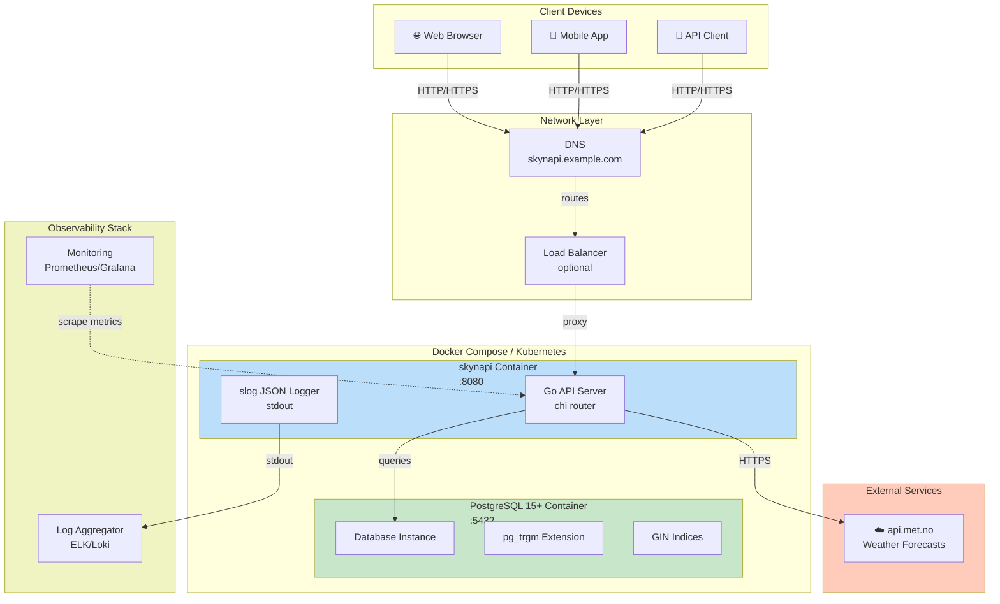

### Environment Configuration

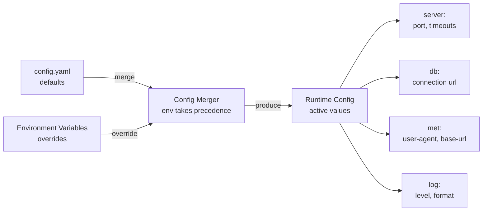

---

## Technology Stack

### Backend & Database

| Component | Technology | Version | Purpose |
|-----------|-----------|---------|---------|
| **Language** | Go | 1.21+ | Type-safe, concurrent, performant |
| **Web Framework** | chi | v5 | Lightweight HTTP router |
| **Database** | PostgreSQL | 15+ | Relational data + extensions |
| **DB Driver** | jackc/pgx | v5 | Type-safe, high-performance |
| **Connection Pool** | pgxpool | - | Safe concurrent access |
| **Logging** | slog | built-in (1.21+) | Structured JSON logging |
| **Validation** | go-playground/validator | - | Input validation |
| **HTTP Client** | net/http | built-in | External API calls |

### PostgreSQL Extensions

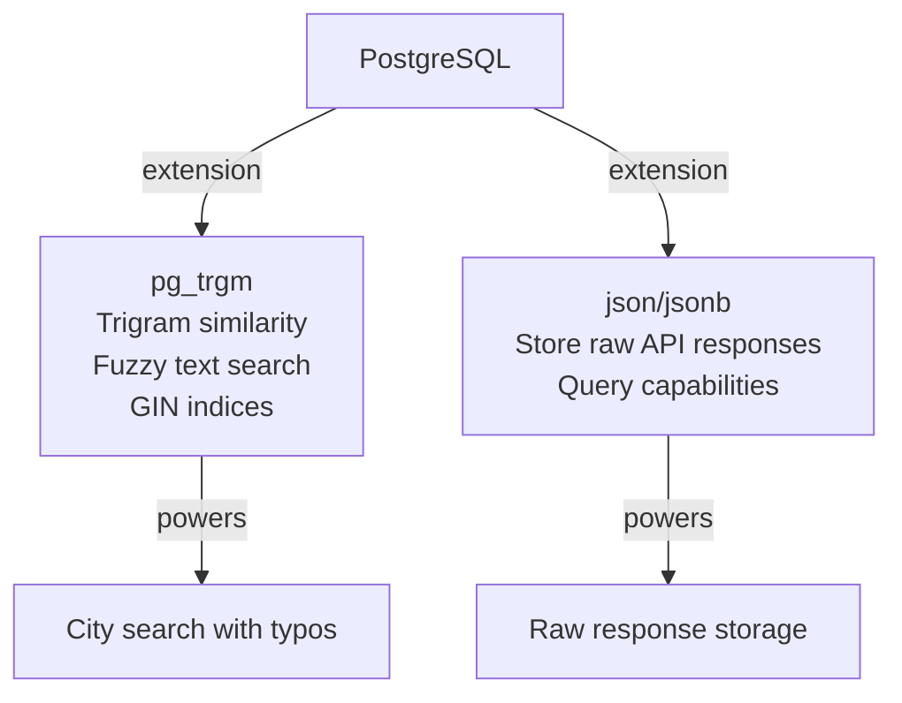

### Development Tools

| Tool | Purpose |
|------|---------|
| **Docker** | Containerization & local development |
| **docker-compose** | Multi-container orchestration |
| **Makefile** | Build automation, version injection |
| **sqlc** | SQL-first type safety (optional) |
| **go test** | Unit & integration testing |
| **moq/testify** | Interface mocking for tests |

### Deployment Options

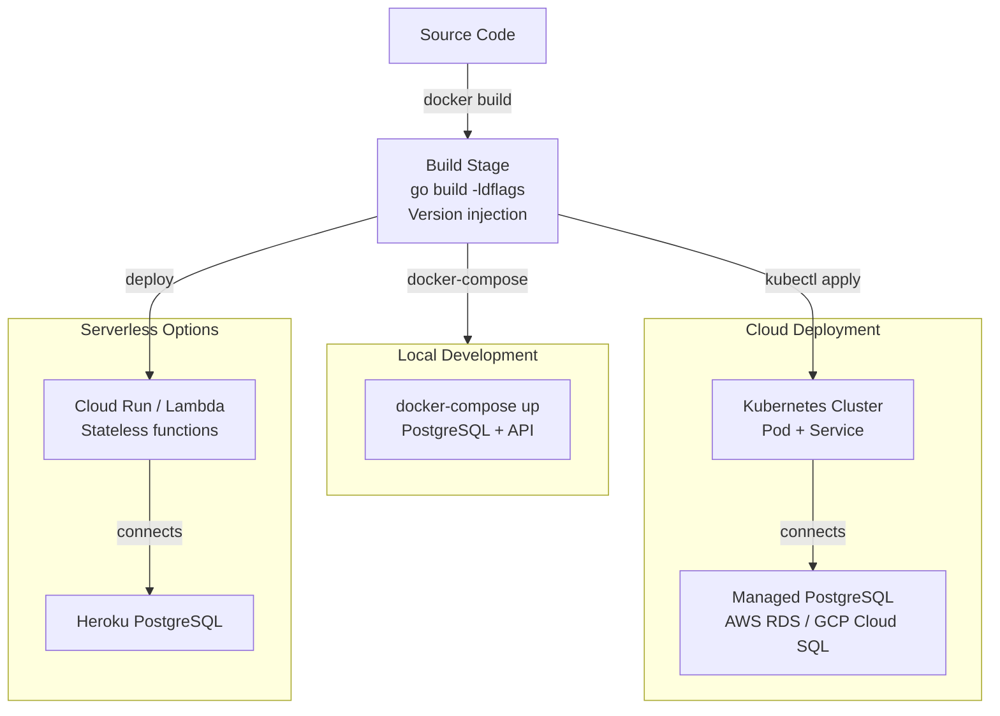

---

## Key Architectural Decisions

### 1. **Interface-Driven Design**
- Every layer uses interfaces for dependencies
- Enables unit testing without real databases/APIs
- Allows easy swapping of implementations

### 2. **Cache-First Weather Strategy**
- Reduces api.met.no API calls (rate limit protection)
- Conditional GET support (304 Not Modified)
- Graceful degradation with stale-cache fallback

### 3. **Structured Logging**
- Go 1.21's `slog` for JSON output
- Production-ready for log aggregation
- Request tracing and observability

### 4. **Type-Safe PostgreSQL**
- `pgxpool` for connection safety
- No ORM (raw SQL + scanning)
- Explicit type casting for trigram operators

### 5. **Clean Separation of Concerns**
- HTTP Layer: Request parsing & response formatting only
- Service Layer: Business logic & orchestration
- Data Layer: Persistence & external APIs
- Testable via mocks at each boundary

---

## Future Enhancements

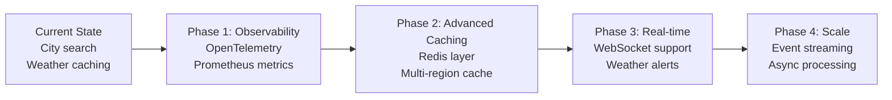

---

## Related Documentation

- [API Specification](../api/openapi.yaml) - OpenAPI 3.0 spec
- [Configuration](../config.yaml.example) - Environment setup
- [Migrations](../migrations/) - Database schema
- [Testing Strategy](./testing.md) - TDD & test patterns

